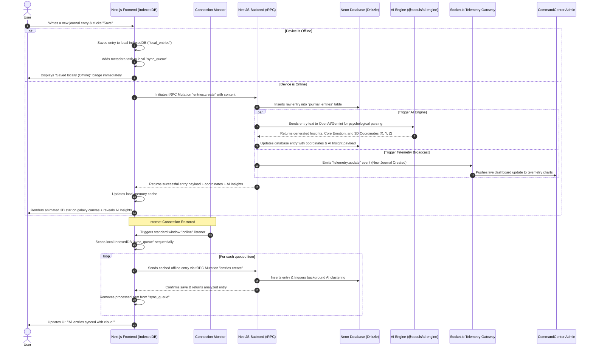
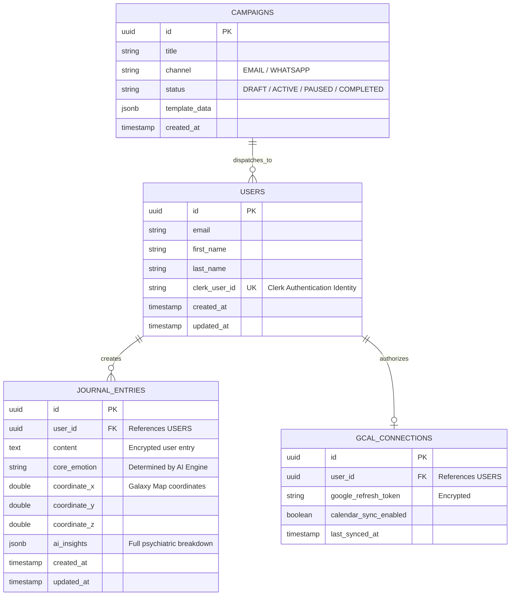
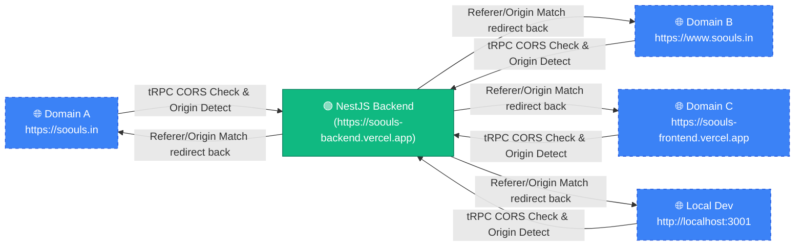

# 🌌 Soouls Monorepo: Comprehensive Architectural Map & System Blueprint

Welcome to the definitive architectural guide and map of the **Soouls** ecosystem. This document provides a highly detailed, comprehensive visual map and technical catalog of how every package, application, data pipeline, and background process operates and interacts within the monorepo.

---

## 🗺️ 1. Global System Architecture

The Soouls platform is built as a state-of-the-art, **Type-Safe, Offline-First Monorepo** powered by **Turborepo**, **Bun**, **TypeScript**, and **tRPC**. Below is the global visual map showing how the user-facing apps, NestJS backend API, shared packages, and external services interact.

```mermaid
graph TD
    %% Styling Classes
    classDef frontend fill:#3b82f6,stroke:#1d4ed8,stroke-width:2px,color:#fff;
    classDef backend fill:#10b981,stroke:#047857,stroke-width:2px,color:#fff;
    classDef pkg fill:#8b5cf6,stroke:#6d28d9,stroke-width:2px,color:#fff;
    classDef database fill:#f59e0b,stroke:#b45309,stroke-width:2px,color:#fff;
    classDef thirdparty fill:#ec4899,stroke:#be185d,stroke-width:2px,color:#fff;

    %% Applications
    FE["💻 Next.js Frontend App<br/>(http://localhost:3001)"]:::frontend
    BE["🟢 NestJS Backend API<br/>(http://localhost:3000)"]:::backend
    AD["📊 CommandCenter Admin App<br/>(http://localhost:3002)"]:::frontend

    %% Shared Packages
    PKG_DB["🗄️ @soouls/database<br/>(Drizzle + Neon Client)"]:::pkg
    PKG_API["🔗 @soouls/api<br/>(tRPC Router & Middleware)"]:::pkg
    PKG_AI["🧠 @soouls/ai-engine<br/>(OpenAI + Gemini LLM)"]:::pkg
    PKG_LOGIC["📐 @soouls/logic<br/>(Galaxy Map Calculations)"]:::pkg
    PKG_UI["🎨 @soouls/ui-kit<br/>(Design Tokens & Elements)"]:::pkg

    %% External Services
    CLERK["🔐 Clerk<br/>(Identity Provider)"]:::thirdparty
    NEON["🐘 Neon Database<br/>(Serverless PostgreSQL)"]:::database
    REDIS["⚡ Upstash Redis<br/>(BullMQ Background Queue)"]:::database
    QSTASH["📮 Upstash QStash<br/>(Serverless Cron & Workers)"]:::thirdparty
    RESEND["📧 Resend<br/>(Transactional Email)"]:::thirdparty
    TWILIO["📱 Twilio<br/>(WhatsApp Messaging)"]:::thirdparty
    SENTRY["📈 Sentry<br/>(Error Tracking)"]:::thirdparty
    POSTHOG["📊 PostHog<br/>(Product Analytics)"]:::thirdparty
    CF_R2["☁️ Cloudflare R2<br/>(Zero-Egress Object Storage)"]:::database

    %% Frontend App Integrations
    FE -->|tRPC API Queries/Mutations| BE
    FE -->|Authenticates & Token Sync| CLERK
    FE -->|3D Canvas Render Calculations| PKG_LOGIC
    FE -->|Theme Tokens & Shared UI Components| PKG_UI
    FE -->|Local Sync & Offline Cache| INDEXED_DB["📦 IndexedDB<br/>(Device Storage)"]:::database
    FE -->|Error Logging| SENTRY
    FE -->|Telemetry Analytics| POSTHOG

    %% Backend App Integrations
    BE -->|Resolves Routes & Schemas| PKG_API
    BE -->|Performs Database Operations| PKG_DB
    BE -->|AI Insight / Cluster Generation| PKG_AI
    BE -->|Real-time Socket.io Telemetry| AD
    BE -->|Enqueues Tasks| REDIS
    BE -->|Webhooks & Triggers| QSTASH
    BE -->|Authenticates Sessions| CLERK
    BE -->|Error Logging| SENTRY

    %% Package & Database Mappings
    PKG_DB -->|Adapter Interface| NEON
    PKG_AI -->|Insight Prompts & Cluster Vector Math| NEON
    REDIS -->|BullMQ Worker Dispatch| RESEND
    REDIS -->|BullMQ Worker Dispatch| TWILIO
    BE -->|Media Upload & Presigned URLs| CF_R2

    %% Sub-graph Styling
    subgraph "Workspace Apps (apps/*)"
        FE
        BE
        AD
    end

    subgraph "Shared Packages (packages/*)"
        PKG_DB
        PKG_API
        PKG_AI
        PKG_LOGIC
        PKG_UI
    end
```

---

## 🗂️ 2. Monorepo Structural Catalog

The Soouls repository is organized into distinct applications (`apps/*`) and shared library packages (`packages/*`). This structure enables **rapid parallel compilation**, **strict boundary enforcement**, and **modular deployment cycles**.

### 📱 Applications (`apps/*`)

| Directory | Name | Tech Stack | Primary Responsibilities |
| :--- | :--- | :--- | :--- |
| [`apps/frontend`](file:///c:/Users/HP/Videos/projects/soouls/apps/frontend) | `@soouls/frontend` | Next.js 16 (App Router), React Three Fiber, Tailwind CSS, Framer Motion, TanStack Query v5 | User interface for journaling, 3D interactive galaxy cluster maps, personalized psychological insights dashboard, offline-first IndexedDB buffer, and account settings. |
| [`apps/backend`](file:///c:/Users/HP/Videos/projects/soouls/apps/backend) | `@soouls/backend` | NestJS, Bun Runtime, tRPC v11 Express Adapter, BullMQ, Socket.io, Pino Logger | Execution engine for tRPC queries/mutations, real-time telemetry WebSockets, transactional messaging workers (Email/WhatsApp), Google Calendar OAuth pipelines, and R2 media orchestrator. |
| [`apps/admin-dashboard`](file:///c:/Users/HP/Videos/projects/soouls/apps/admin-dashboard) | `@soouls/admin-dashboard` | Next.js 16, Recharts, Socket.io Client, Radix UI primitives, cmdk command palette | Internal operations console ("SoulLabs Command Center") featuring real-time system performance monitor, waitlist coordinator, and marketing campaign managers. |

### 📦 Shared Packages (`packages/*`)

| Directory | Name | Primary Dependencies | Core Functionality & Deliverables |
| :--- | :--- | :--- | :--- |
| [`packages/database`](file:///c:/Users/HP/Videos/projects/soouls/packages/database) | `@soouls/database` | Drizzle ORM, `@neondb/serverless` | Single source of truth for the database schema, Drizzle migration scripts, database client bootstrapping, and Neon serverless connectivity configuration. |
| [`packages/api`](file:///c:/Users/HP/Videos/projects/soouls/packages/api) | `@soouls/api` | `@trpc/server`, `zod` | Defines the global, unified tRPC router structure, request validation schemas (Zod), rate-limiting controllers, and the user masquerading API middleware. |
| [`packages/ai-engine`](file:///c:/Users/HP/Videos/projects/soouls/packages/ai-engine) | `@soouls/ai-engine` | `openai`, `@google/generative-ai` | The core intelligence layer housing model prompt templates, token counting routines, and structured generators for mental state insights and coordinate-based clustering. |
| [`packages/logic`](file:///c:/Users/HP/Videos/projects/soouls/packages/logic) | `@soouls/logic` | Pure TypeScript | Mathematics and physics algorithms for coordinate transformations, gravity simulations, and position vectors mapping journal entries into a 3D galaxy canvas. |
| [`packages/ui-kit`](file:///c:/Users/HP/Videos/projects/soouls/packages/ui-kit) | `@soouls/ui-kit` | Tailwind CSS, React, Lucide Icons | Harmonious style definitions (colors, fonts, glassmorphism), shared custom design tokens, and highly reusable components shared between frontend/admin dashboards. |
| [`packages/typescript-config`](file:///c:/Users/HP/Videos/projects/soouls/packages/typescript-config) | `@soouls/typescript-config` | TypeScript | Centralized `tsconfig.json` bases for Next.js, NestJS, and pure TypeScript library packages. |

---

## ⚡ 3. End-to-End Journaling & AI Processing Pipeline

This diagram maps out exactly what happens when a user writes a new journal entry—including how the system maintains high performance and safety when **offline**, and how it syncs, analyzes, clusters, and broadcasts telemetry to the admin dashboard when **online**.

---

## 🗃️ 4. Detailed Database Entity Schema

All database interactions utilize the `@soouls/database` package. The system is modeled using a relational, vector-adjacent schema for high-performance retrieval and graphing:

---

## 🔒 5. Authentication, Networking & Dynamic Domains

To allow the application to run successfully across multiple development environments and live deployments (Vercel previews, custom production domains, local development), Soouls utilizes a dynamic, unified networking paradigm:

### Key Networking Policies
1. **Dynamic CORS Matching**: In `apps/backend/src/main.ts`, the server splits `process.env.FRONTEND_URL` and `CORS_ALLOWED_ORIGINS` by commas to dynamically registers CORS allowance for all live environments.
2. **Referer-Aware Redirects**: When external entities (such as **Google OAuth** callbacks for calendar sync) redirect back to the frontend, `google-calendar.controller.ts` dynamically matches the request's `referer` or `origin` header to redirect the user back to the exact domain they initiated the request from (e.g., preserving domain pathing on `soouls.in`).
3. **Clerk Token Synchronization**: The Next.js frontend handles secure Clerk JWT creation. Every tRPC request automatically passes this token via the `Authorization` or `X-Clerk-Authorization` headers, ensuring complete end-to-end user identification without state overhead.

---

> [!NOTE]
> All shared dependencies, configuration profiles, and database schemas are version-locked via `bun.lock` at the monorepo root to guarantee zero drift across multiple build targets.
